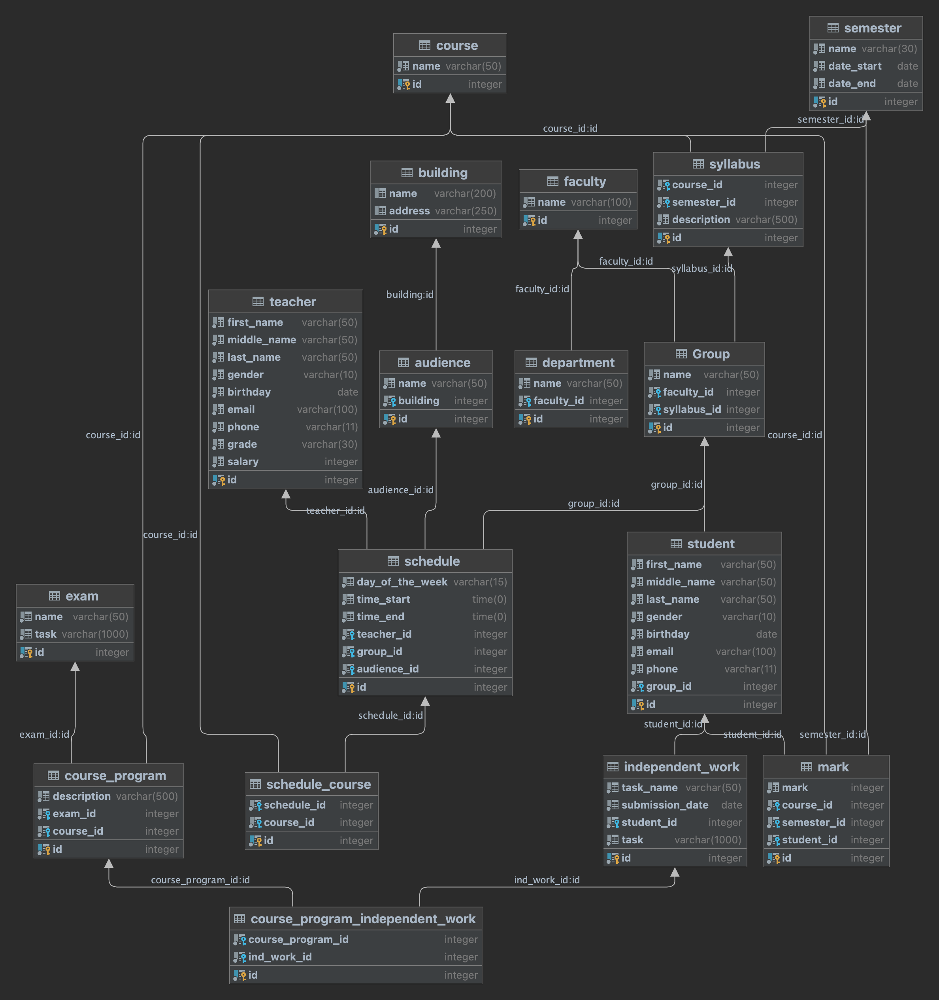

# University Management System

[Russian](../README.md) | **English**

This project is an API for a university management system that allows performing operations with data about students, teachers, courses, and student grades.

## Installation

```angular2html
git clone https://github.com/MashkaCoder/university_management_systems.git
cd university_management_systems
```
Create a virtual environment and install the necessary libraries:

```angular2html
pip install -r requirements.txt
```

## Database Configuration

1. Make sure that the PostgreSQL server is installed and running on your computer. 
2. Create a database named `university` in pgAdmin. 
3. Specify the corresponding values of the `host`, `port`, `username`, and `database` name to connect to the database in the `api_point.py` file or replace the corresponding data with your own. 
4. Connect to the created university database using your preferred method and run the script to create the tables `create_db.sql` and populate the database `insert_values_to_db.sql`.

## Running the Application

1. Start the API server using the following command:

```angular2html
uvicorn api_point:app --reload
```

2. The application will be available at `http://localhost:8000`.

## API Documentation

After launching the application, you can view and test the available endpoints by visiting `http://localhost:8000/docs`. In the API documentation, you will find detailed descriptions and example requests for each endpoint.

## ER Diagram


## Entity Descriptions and Their Properties

<details>
<summary>Student</summary>

- id (int): Unique identifier of the student
- first_name (varchar(50)): First name of the student
- middle_name (varchar(50)): Middle name of the student
- last_name (varchar(50)): Last name of the student
- gender (varchar(10)): Gender of the student
- birthday (date): Birthdate of the student
- email (varchar(100)): Email of the student
- phone (varchar(11)): Phone number of the student
- group_id (int): Identifier of the group to which the student belongs
</details>

<details>
<summary>Teacher</summary>

- id (int): Unique identifier of the teacher
- first_name (varchar(50)): First name of the teacher
- middle_name (varchar(50)): Middle name of the teacher
- last_name (varchar(50)): Last name of the teacher
- gender (varchar(10)): Gender of the teacher
- birthday (date): Birthdate of the teacher
- email (varchar(100)): Email of the teacher
- phone (varchar(11)): Phone number of the teacher
- grade (varchar(30)): Academic degree of the teacher
- salary (int): Salary of the teacher
</details>

<details>
<summary>Course</summary>

- id (int): Unique identifier of the course
- name (varchar(50)): Name of the course
</details>

<details>
<summary>Group</summary>

- id (int): Unique identifier of the group
- name (varchar(50)): Name of the group
- faculty_id (int): Identifier of the faculty to which the group belongs
- syllabus_id (int): Identifier of the syllabus associated with the group
</details>

<details>
<summary>Department</summary>

- id (int): Unique identifier of the department
- name (varchar(50)): Name of the department
- faculty_id (int): Identifier of the faculty to which the department belongs
</details>

<details>
<summary>Mark</summary>

- id (int): Unique identifier of the mark
- mark (int): Grade/Mark
- course_id (int): Identifier of the course
- semester_id (str): Identifier of the semester
- student_id (int): Identifier of the student
</details>

<details>
<summary>Schedule</summary>

- id (int): Unique identifier of the schedule
- day_of_the_week (varchar(15)): Day of the week for the schedule
- time_start (time): Start time of the class
- time_end (time): End time of the class
- teacher_id (int): Identifier of the teacher conducting the class
- group_id (int): Identifier of the group for which the schedule is created
- audience_id (int): Identifier of the audience where the class takes place
</details>

<details>
<summary>Schedule Course</summary>

- id (int): Unique identifier of the schedule course entry
- schedule_id (int): Identifier of the schedule
- course_id (int): Identifier of the course associated with the schedule
</details>

<details>
<summary>Building</summary>

- id (int): Unique identifier of the building
- name (varchar(200)): Name of the building
- address (varchar(250)): Address of the building
</details>

<details>
<summary>Audience</summary>

- id (int): Unique identifier of the audience
- name (varchar(50)): Name of the audience
- building (int): Identifier of the building
</details>

<details>
<summary>Semester</summary>

- id (int): Unique identifier of the semester
- name (varchar(30)): Name of the semester
- date_start (date): Start date of the semester
- date_end (date): End date of the semester
</details>

<details>
<summary>Faculty</summary>

- id (int): Unique identifier of the faculty
- name (varchar(100)): Name of the faculty
</details>

<details>
<summary>Exam</summary>

- id (int): Unique identifier of the exam
- name (varchar(50)): Name of the exam
- task (varchar(1000)): Exam task
</details>

<details>
<summary>Independent Work</summary>

- id (int): Unique identifier of the independent work
- task_name (varchar(50)): Name of the independent work
- submission_date (date): Submission deadline of the independent work
- student_id (int): Identifier of the student who submitted the work
- task (varchar(1000)): Independent work task
</details>

<details>
<summary>Course Program Independent Work</summary>

- id (int): Unique identifier of the course program independent work entry
- course_program_id (int): Identifier of the course program to which the independent work belongs
- ind_work_id (int): Identifier of the independent work included in the course program
</details>

<details>
<summary>Course Program</summary>

- id (int): Unique identifier of the course program
- description (varchar(500)): Description of the course program
- course_id (int): Identifier of the course to which the program belongs
- exam_id (int): Identifier of the exam related to the program
</details>

<details>
<summary>Syllabus</summary>

- id (int): Unique identifier of the syllabus
- course_id (int): Identifier of the course
- semester_id (int): Identifier of the semester
- description (varchar(500)): Description of the syllabus
</details>

## Project Files

- `api_point.py` - the main FastAPI application file containing API endpoints
- `models.py` - definition of Pydantic models for routes
- `index.html` - the starting page file of the application containing descriptions of available endpoints
- `create_db.sql` - script to create database tables
- `insert_values_to_db.sql` - script to populate the database tables
- `query_db.sql` - some SQL queries to the database
- `requirements.txt` - list of project dependencies.